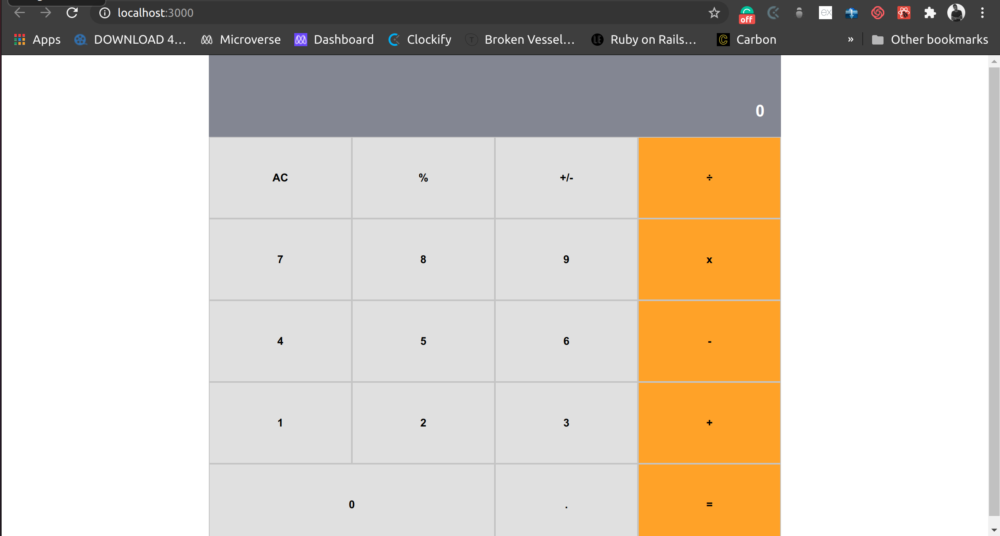

This is a simple calculator project designed in React that makes basic calculations

## Live Preview

Open the [live preview](https://sample-react-calc.herokuapp.com/) to view it in the browser.

## Available Scripts

In the project directory, you can run:

### `yarn start`

Runs the app in the development mode. 
Open [http://localhost:3000](http://localhost:3000) to view it in the browser.

The page will reload if you make edits. 
You will also see any lint errors in the console.

### `yarn test`

Launches the test runner in the interactive watch mode. 
See the section about [running tests](https://facebook.github.io/create-react-app/docs/running-tests) for more information.

👤 **Author**

- Leonard Rwai Kanyesigye:
[Github](https://github.com/rmauritsson),
[Twitter](https://twitter.com/leokanye),

## 🤝 Contributing

Contributions, issues and feature requests are welcome!

Feel free to check the [issues page](issues/).

## Show your support

Give a ⭐️ if you like this project!
